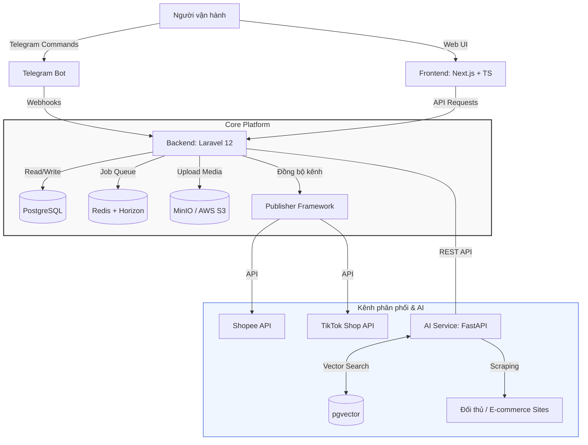
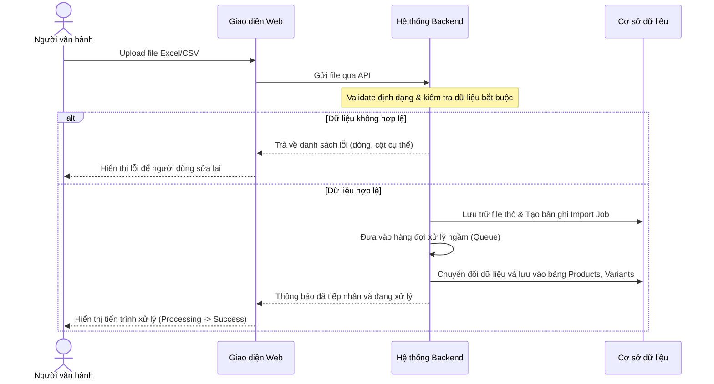
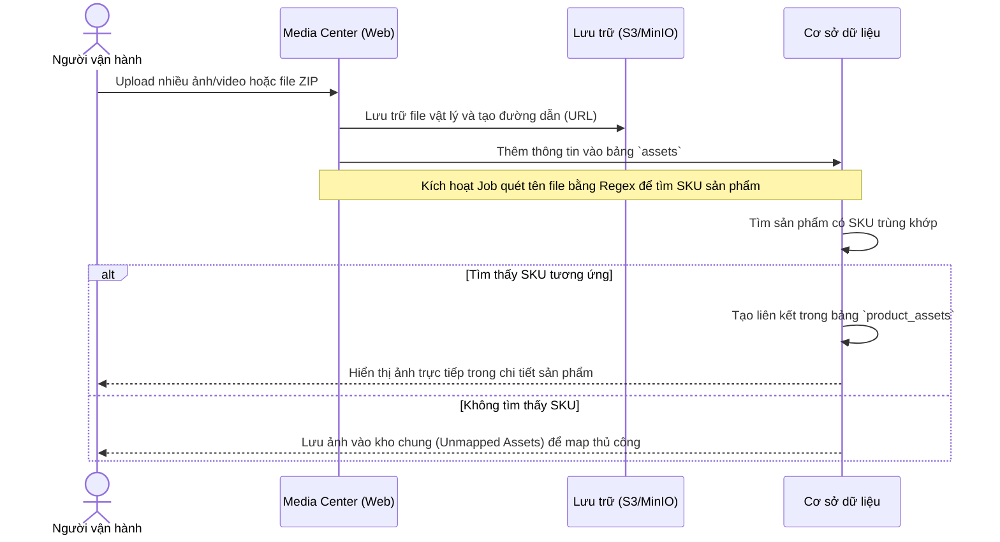

# Auto Commerce OS (ACOS)
> **Hệ điều hành AI cho vận hành Thương mại Điện tử (AI-Powered E-commerce Operations OS)**

Auto Commerce OS (ACOS) là một nền tảng trung tâm (Core Platform) được thiết kế nhằm tối ưu hóa, chuẩn hóa và tự động hóa toàn bộ quy trình vận hành kinh doanh trên các sàn thương mại điện tử (Shopee, TikTok Shop, Lazada,...). Hệ thống hướng tới việc giảm thiểu tối đa nguồn lực nhân sự bằng cách ứng dụng AI vào các khâu tự động thu thập dữ liệu, sáng tạo nội dung, tối ưu hóa SEO và quản lý vận hành đa kênh.

---

## 1. Tầm nhìn dài hạn

ACOS không chỉ dừng lại ở một công cụ quản lý mà hướng tới trở thành một **"AI Operating System"** hoàn chỉnh cho doanh nghiệp TMĐT. Trong tương lai, mô hình vận hành sẽ được dịch chuyển hoàn toàn:

```
[Đối thủ / Thị trường] ──(AI Crawl)──> [ACOS Engine] ──(AI Generate & SEO)──> [Duyệt nhanh] ──(AI Publish)──> [Các sàn TMĐT]
                                                                                  │
                                                                           (Báo cáo Telegram)
```

*   **AI tự động hóa:** Tự động quét dữ liệu đối thủ, tự động sinh nội dung (tiêu đề, mô tả, từ khóa), tối ưu hóa SEO, chuẩn bị hình ảnh/video và tự động đăng tải lên các sàn.
*   **Điều khiển tinh gọn:** Người vận hành đóng vai trò là người phê duyệt cuối cùng (Approver) và ra quyết định thông qua các kênh tiện lợi như Telegram.

---

## 2. Phạm vi dự án (MVP vs. Future)

Để đảm bảo tiến độ và chất lượng, dự án được chia làm hai giai đoạn rõ ràng:

| Tính năng | Giai đoạn 1 (MVP) | Giai đoạn 2 & Tương lai (Non-MVP) |
| :--- | :---: | :---: |
| **Hệ thống cốt lõi** | Quản lý sản phẩm, Danh mục, Thương hiệu, Nhà cung cấp, **Multi-tenant (SaaS)**, **Thuộc tính động (Multi-industry)** | Phân quyền chi tiết (RBAC) |
| **Media Center** | Quản lý ảnh/video độc lập, Tự động map sản phẩm qua tên file | Tự động tối ưu dung lượng, Đóng dấu ảnh (Watermark) hàng loạt |
| **Xử lý dữ liệu** | Import/Export Excel & CSV | Đồng bộ thời gian thực từ Google Sheet, Kết nối API bên thứ 3 |
| **Đăng tải đa kênh** | Chuẩn bị cấu trúc dữ liệu để sẵn sàng tích hợp | Publisher Framework (Shopee, TikTok Shop, Web tự sở hữu) |
| **Trợ lý AI** | Chưa tích hợp | Tự động cào dữ liệu đối thủ, Sinh nội dung chuẩn SEO bằng LLM |
| **Hệ thống điều khiển** | Giao diện Web (Dashboard) | Điều khiển & nhận báo cáo trực tiếp qua Telegram Bot |
| **Quản trị vận hành** | Nhật ký hoạt động (Activity Log), Thông báo nội bộ | Quản lý đơn hàng (OMS), Kho vận nâng cao (WMS), CRM & ERP |

---

## 3. Kiến trúc hệ thống đề xuất

Dưới đây là mô hình kiến trúc tổng thể của hệ thống, phân tách rõ ràng giữa ứng dụng Web quản lý và dịch vụ AI độc lập:



---

## 4. Luồng nghiệp vụ chính

### 4.1. Luồng Import Sản phẩm từ Excel/CSV
Quy trình giúp người dùng đưa hàng loạt sản phẩm lên hệ thống một cách nhanh chóng và chính xác.



### 4.2. Luồng Upload Media & Tự động ánh xạ (Auto Mapping)
Hệ thống cho phép tải lên hình ảnh/video hàng loạt và tự động liên kết chúng với sản phẩm dựa trên quy tắc đặt tên file (ví dụ: đặt tên file theo SKU sản phẩm).



---

## 5. Thiết kế chi tiết các Module

### 5.1. Product Management (Quản lý sản phẩm)
Module quản lý toàn bộ thông tin sản phẩm từ thông tin cơ bản, thuộc tính SEO, đến các phiên bản biến thể, hỗ trợ đa doanh nghiệp và đa ngành hàng.

*   **Thông tin cốt lõi (Core Fields):**
    *   *Phân tách dữ liệu:* Thuộc về một Cửa hàng/Doanh nghiệp cụ thể (`tenant_id`).
    *   *Định danh:* SKU (mã định danh duy nhất trong mỗi store), Barcode.
    *   *Thông tin cơ bản:* Tên sản phẩm, Thương hiệu (Brand), Danh mục (Category), Nhà cung cấp (Supplier).
    *   *Giá cả:* Giá vốn (Cost Price), Giá bán lẻ (Price), Giá khuyến mãi (Sale Price).
    *   *Tồn kho:* Số lượng tồn kho (Stock).
    *   *Thông số kỹ thuật động:* Lưu trữ thông tin đặc thù của từng ngành hàng dưới dạng `JSON` (ví dụ: Chất liệu, Xuất xứ với thời trang; CPU, Pin với điện thoại) được định nghĩa linh hoạt trong bảng `attributes`.
    *   *Tối ưu hóa tìm kiếm (SEO):* Slug (độc nhất theo store), Tiêu đề SEO (SEO Title), Mô tả SEO (SEO Description).
    *   *Phân loại & tìm kiếm nhanh:* Tags, Mô tả ngắn, Mô tả chi tiết.
*   **Quản lý biến thể (Product Variants):**
    *   Hỗ trợ sản phẩm có nhiều thuộc tính biến thể (ví dụ: Kích thước, Màu sắc đối với quần áo; Dung lượng, Màu sắc đối với điện thoại).
    *   Lưu trữ các giá trị thuộc tính biến thể dưới dạng `JSON` (`attribute_values`).
    *   Mỗi biến thể có SKU riêng (độc nhất theo store), Barcode riêng, Giá bán riêng, và số lượng tồn kho riêng biệt.

### 5.2. Media Center (Trung tâm lưu trữ)
Hệ thống quản lý tệp tin đa phương tiện được thiết kế tách biệt với sản phẩm để tối ưu khả năng tái sử dụng hình ảnh/video.

*   **Chức năng chính:**
    *   Hỗ trợ tải lên nhiều file cùng lúc, tải lên cả thư mục hoặc giải nén từ file `.zip`.
    *   Xem trước (Preview) ảnh/video trực quan.
    *   Đổi tên, xóa tệp, tải xuống (Download) và gắn thẻ tag để phân loại.
    *   Hỗ trợ tính năng ghi đè (Replace) file cũ nhưng giữ nguyên liên kết với sản phẩm.
*   **Định dạng hỗ trợ:**
    *   *Hình ảnh:* `.jpg`, `.jpeg`, `.png`, `.webp`.
    *   *Video:* `.mp4`, `.mov`, `.webm`.

### 5.3. Import Engine
Hỗ trợ xử lý dữ liệu đầu vào thông qua các tệp tin bảng tính.
*   **Định dạng hỗ trợ ở MVP:** Excel (`.xlsx`), CSV (`.csv`).
*   **Quy trình xử lý:**
    1.  **Tải lên:** User tải file lên giao diện.
    2.  **Đọc cấu trúc:** Hệ thống phân tích các cột và ánh xạ với các trường trong Database.
    3.  **Kiểm tra lỗi (Validation):** Kiểm tra trùng lặp SKU, định dạng số, các trường bắt buộc.
    4.  **Hàng đợi (Queue):** Xử lý ngầm qua Redis để tránh nghẽn hệ thống khi import hàng ngàn sản phẩm.
    5.  **Báo cáo:** Trả về file Excel kết quả chứa thông tin chi tiết các dòng bị lỗi (nếu có).

### 5.4. Publisher Framework (Khung đăng tải)
Thiết kế theo **Provider Pattern** để dễ dàng mở rộng tích hợp các sàn TMĐT khác nhau trong tương lai mà không làm ảnh hưởng đến logic cốt lõi của hệ thống.

*   **Trạng thái hàng đợi đăng tải (Queue Status):**
    *   `Waiting`: Đang chờ đến lượt xử lý.
    *   `Processing`: Đang đồng bộ dữ liệu lên sàn qua API.
    *   `Success`: Đăng tải thành công, lưu lại Link sản phẩm trên sàn.
    *   `Failed`: Đăng tải thất bại, lưu lại chi tiết mã lỗi từ sàn để người dùng xử lý.

---

## 6. Thiết kế tính năng tương lai (Future Specs)

### 6.1. AI Content Engine (Dịch vụ AI độc lập)
Để tối ưu hiệu năng, dịch vụ AI được xây dựng thành một service riêng biệt tương tác qua API.

*   **Nhiệm vụ chính:**
    *   Tự động cào (crawl) thông tin sản phẩm từ các đối thủ cạnh tranh trên thị trường.
    *   Phân tích mật độ từ khóa và xu hướng tìm kiếm để tối ưu SEO.
    *   Tự động viết lại Tiêu đề (Title), Mô tả sản phẩm (Description) hấp dẫn, không trùng lặp để tránh quét bản quyền của sàn.
    *   Tự động gắn thẻ tag phù hợp.
    *   Xuất bản file Excel mẫu chuẩn hóa để sẵn sàng import ngược lại vào hệ thống Web.

### 6.2. Telegram Control Center
Cho phép người quản lý vận hành và ra lệnh cho hệ thống một cách nhanh chóng qua ứng dụng nhắn tin Telegram.

| Lệnh | Ý nghĩa | Ví dụ sử dụng |
| :--- | :--- | :--- |
| `/report` | Xem nhanh báo cáo tồn kho, sản phẩm mới trong ngày | `/report today` |
| `/publish` | Duyệt và đăng tải danh sách sản phẩm đã chuẩn bị lên sàn | `/publish batch_123` |
| `/crawl [keyword/url]` | Yêu cầu AI quét thông tin sản phẩm theo từ khóa hoặc đường dẫn | `/crawl nike air max` |
| `/jobs` | Kiểm tra trạng thái các tiến trình AI đang chạy ngầm | `/jobs status` |
| `/approve [job_id]` | Xác nhận phê duyệt nội dung AI đã sinh để đưa vào kho sản phẩm | `/approve job_99` |

---

## 7. Thiết kế Cơ sở Dữ liệu chính

Hệ thống sử dụng hệ quản trị cơ sở dữ liệu **PostgreSQL/MySQL** hỗ trợ Multi-tenant (phân tách bằng `tenant_id`) và lưu trữ thuộc tính động bằng cột `JSON`:

```
                   ┌──────────────────┐
                   │     tenants      │
                   └────────┬─────────┘
                            │ (1:N)
      ┌─────────────┬───────┼─────────────┬─────────────┐
      ▼             ▼       ▼             ▼             ▼
┌──────────┐ ┌──────────┐ ┌──────────┐ ┌──────────┐ ┌──────────┐
│  users   │ │categories│ │  brands  │ │suppliers │ │products  │
└──────────┘ └──────────┘ └──────────┘ └──────────┘ └────┬─────┘
                                                        │ (1:N)
                                                        ├─> product_variants
                                                        │
                                                        └─> product_assets ◄── assets
```

1.  **`tenants`**: Quản lý các doanh nghiệp/cửa hàng thuê hệ thống (tên, tên miền riêng, ngành hàng chính, cấu hình...).
2.  **`attributes`**: Định nghĩa thuộc tính động cho từng doanh nghiệp (ví dụ: Màu sắc, Kích cỡ, RAM, OS, Pin...).
3.  **`users`**: Tài khoản quản trị hệ thống (Super Admin) hoặc tài khoản nhân viên/khách hàng thuộc một doanh nghiệp (`tenant_id`).
4.  **`products`**: Thông tin chung của sản phẩm thuộc doanh nghiệp (`tenant_id`). Chứa cột `attributes` kiểu dữ liệu `JSON` để lưu trữ các thông số động không đổi giữa các phiên bản sản phẩm (ví dụ: Chất liệu, Xuất xứ, CPU).
5.  **`product_variants`**: Các phiên bản biến thể của sản phẩm thuộc doanh nghiệp (`tenant_id`). Chứa cột `attribute_values` kiểu dữ liệu `JSON` để lưu các thuộc tính tạo nên biến thể (ví dụ: `{"color": "Đỏ", "size": "M"}`).
6.  **`categories`**: Danh mục sản phẩm (phân tách theo `tenant_id`, hỗ trợ cấu trúc đa cấp, slug độc nhất theo từng store).
7.  **`brands`**: Thương hiệu sản phẩm (phân tách theo `tenant_id`).
8.  **`suppliers`**: Nhà cung cấp sản phẩm (phân tách theo `tenant_id`).
9.  **`assets`**: Kho quản lý file đa phương tiện chung (phân tách theo `tenant_id`).
10. **`product_assets`**: Bảng trung gian liên kết sản phẩm với hình ảnh/video.
11. **`imports` / `exports`**: Nhật ký và tệp tin của các phiên import/export dữ liệu (phân tách theo `tenant_id`).
12. **`publish_jobs` / `publish_logs`**: Theo dõi tiến trình đăng tải sản phẩm lên các sàn TMĐT (phân tách theo `tenant_id`).
13. **`activity_logs`**: Ghi lại mọi thao tác của người dùng trên hệ thống.

---

## 8. Công nghệ đề xuất

> [!NOTE]
> Lựa chọn công nghệ tập trung vào sự ổn định, khả năng mở rộng tốt và tốc độ phát triển nhanh để nhanh chóng đưa sản phẩm MVP ra thị trường.

| Thành phần | Công nghệ lựa chọn | Vai trò & Lý do lựa chọn |
| :--- | :--- | :--- |
| **Frontend** | **Next.js + TypeScript** | Tối ưu hóa SEO tốt (SSR/ISR), hiệu năng cao, xây dựng giao diện quản trị mượt mà. |
| **UI Library** | **Tailwind CSS + shadcn/ui** | Giúp thiết kế giao diện hiện đại, chuyên nghiệp, nhất quán và tùy biến nhanh chóng. |
| **Backend** | **Laravel 12** | Framework mạnh mẽ, cung cấp sẵn hệ thống ORM (Eloquent), Authentication, Queue và các công cụ quản lý bảo mật tốt nhất. |
| **Database** | **PostgreSQL** | Cơ sở dữ liệu quan hệ mạnh mẽ, hỗ trợ tốt các truy vấn phức tạp và tích hợp dễ dàng với AI nhờ `pgvector`. |
| **Queue / Cache** | **Redis + Laravel Horizon** | Quản lý và giám sát trực quan các hàng đợi xử lý ngầm (Import/Export, Sync API lên sàn). |
| **Storage** | **MinIO (Local) → AWS S3** | MinIO giúp dễ dàng phát triển và kiểm thử ở môi trường local trước khi chuyển sang AWS S3 ở môi trường production. |
| **AI Service** | **Python + FastAPI** | Tối ưu cho các tác vụ xử lý ngôn ngữ tự nhiên (NLP), kết nối LLM và cào dữ liệu. |
| **Vector DB** | **pgvector** | Extension trực tiếp trên PostgreSQL giúp lưu trữ và tìm kiếm vector (nhận diện sản phẩm tương đồng) mà không cần cài thêm DB phụ. |
| **Container** | **Docker & Docker Compose** | Chuẩn hóa môi trường phát triển và triển khai hệ thống một cách nhanh chóng, đồng bộ. |
| **Giám sát** | **Sentry + Grafana** | Theo dõi lỗi ứng dụng thời gian thực và giám sát hiệu năng phần cứng/dịch vụ. |

---

## 9. Lộ trình phát triển (Roadmap)

*   **Giai đoạn 1: Xây dựng nền tảng (MVP)**
    *   Thiết lập cơ sở dữ liệu và môi trường Docker.
    *   Hoàn thiện Module Sản phẩm, Danh mục và Biến thể.
    *   Xây dựng Media Center với tính năng tự động liên kết ảnh qua SKU.
    *   Hoàn thiện tính năng Import/Export sản phẩm qua Excel/CSV.
*   **Giai đoạn 2: Tích hợp và Đồng bộ (Publisher)**
    *   Phát triển khung kết nối đa kênh (Publisher Framework).
    *   Tích hợp API đồng bộ sản phẩm lên Shopee.
    *   Tích hợp API đồng bộ sản phẩm lên TikTok Shop.
*   **Giai đoạn 3: Tự động hóa vận hành (Telegram & Scheduler)**
    *   Xây dựng Telegram Bot nhận thông báo trạng thái kho hàng, đơn hàng.
    *   Tích hợp các lệnh điều khiển hệ thống cơ bản qua Telegram.
    *   Thiết lập lịch trình báo cáo tự động hàng ngày/hàng tuần.
*   **Giai đoạn 4: Trợ lý thông minh (AI Integration)**
    *   Phát triển AI Content Engine độc lập bằng Python.
    *   Tích hợp tính năng cào dữ liệu đối thủ và tự động tối ưu hóa SEO bằng AI.
    *   Tối ưu hóa gợi ý giá bán và dự báo tồn kho bằng học máy.