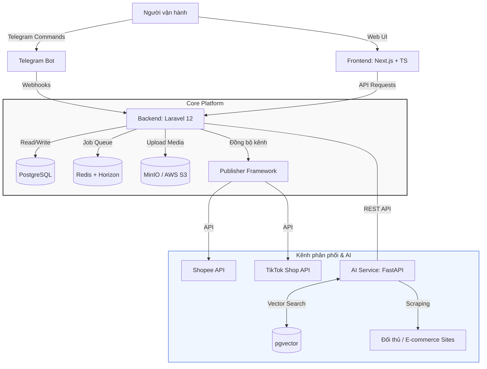
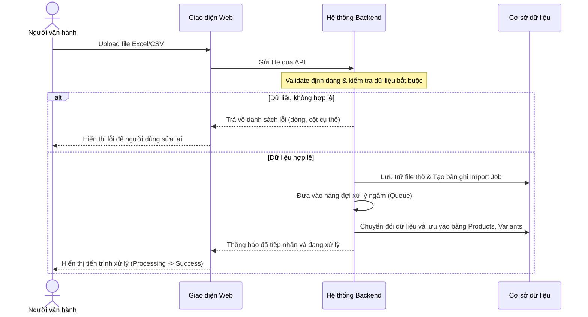
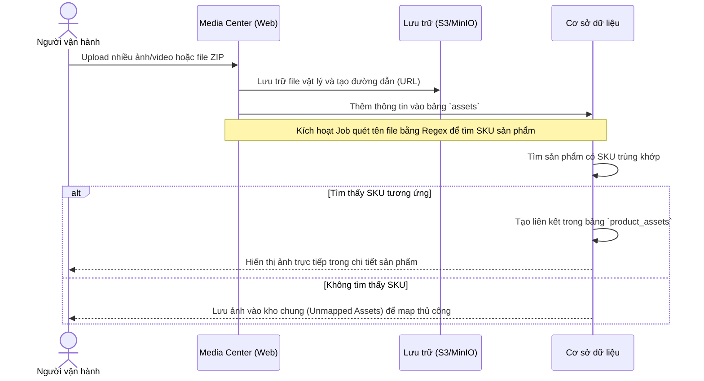

# Auto Commerce OS (ACOS)
> **Hệ điều hành AI cho vận hành Thương mại Điện tử (AI-Powered E-commerce Operations OS)**

Auto Commerce OS (ACOS) là một nền tảng trung tâm (Core Platform) được thiết kế nhằm tối ưu hóa, chuẩn hóa và tự động hóa toàn bộ quy trình vận hành kinh doanh trên các sàn thương mại điện tử (Shopee, TikTok Shop, Lazada,...). Hệ thống hướng tới việc giảm thiểu tối đa nguồn lực nhân sự bằng cách ứng dụng AI vào các khâu tự động thu thập dữ liệu, sáng tạo nội dung, tối ưu hóa SEO và quản lý vận hành đa kênh.

---

## 1. Tầm nhìn dài hạn

ACOS không chỉ dừng lại ở một công cụ quản lý mà hướng tới trở thành một **"AI Operating System"** hoàn chỉnh cho doanh nghiệp TMĐT. Trong tương lai, mô hình vận hành sẽ được dịch chuyển hoàn toàn:

```
[Đối thủ / Thị trường] ──(AI Crawl)──> [ACOS Engine] ──(AI Generate & SEO)──> [Duyệt nhanh] ──(AI Publish)──> [Các sàn TMĐT]
                                                                                  │
                                                                           (Báo cáo Telegram)
```

*   **AI tự động hóa:** Tự động quét dữ liệu đối thủ, tự động sinh nội dung (tiêu đề, mô tả, từ khóa), tối ưu hóa SEO, chuẩn bị hình ảnh/video và tự động đăng tải lên các sàn.
*   **Điều khiển tinh gọn:** Người vận hành đóng vai trò là người phê duyệt cuối cùng (Approver) và ra quyết định thông qua các kênh tiện lợi như Telegram.

---

## 2. Phạm vi dự án (MVP vs. Future)

Để đảm bảo tiến độ và chất lượng, dự án được chia làm hai giai đoạn rõ ràng:

| Tính năng | Giai đoạn 1 (MVP) | Giai đoạn 2 & Tương lai (Non-MVP) |
| :--- | :---: | :---: |
| **Hệ thống cốt lõi** | Quản lý sản phẩm, Danh mục, Thương hiệu, Nhà cung cấp, **Multi-tenant (SaaS)**, **Thuộc tính động (Multi-industry)** | Phân quyền chi tiết (RBAC) |
| **Media Center** | Quản lý ảnh/video độc lập, Tự động map sản phẩm qua tên file | Tự động tối ưu dung lượng, Đóng dấu ảnh (Watermark) hàng loạt |
| **Xử lý dữ liệu** | Import/Export Excel & CSV | Đồng bộ thời gian thực từ Google Sheet, Kết nối API bên thứ 3 |
| **Đăng tải đa kênh** | Chuẩn bị cấu trúc dữ liệu để sẵn sàng tích hợp | Publisher Framework (Shopee, TikTok Shop, Web tự sở hữu) |
| **Trợ lý AI** | Chưa tích hợp | Tự động cào dữ liệu đối thủ, Sinh nội dung chuẩn SEO bằng LLM |
| **Hệ thống điều khiển** | Giao diện Web (Dashboard) | Điều khiển & nhận báo cáo trực tiếp qua Telegram Bot |
| **Quản trị vận hành** | Nhật ký hoạt động (Activity Log), Thông báo nội bộ | Quản lý đơn hàng (OMS), Kho vận nâng cao (WMS), CRM & ERP |

---

## 3. Kiến trúc hệ thống đề xuất

Dưới đây là mô hình kiến trúc tổng thể của hệ thống, phân tách rõ ràng giữa ứng dụng Web quản lý và dịch vụ AI độc lập:



---

## 4. Luồng nghiệp vụ chính

### 4.1. Luồng Import Sản phẩm từ Excel/CSV
Quy trình giúp người dùng đưa hàng loạt sản phẩm lên hệ thống một cách nhanh chóng và chính xác.



### 4.2. Luồng Upload Media & Tự động ánh xạ (Auto Mapping)
Hệ thống cho phép tải lên hình ảnh/video hàng loạt và tự động liên kết chúng với sản phẩm dựa trên quy tắc đặt tên file (ví dụ: đặt tên file theo SKU sản phẩm).



---

## 5. Thiết kế chi tiết các Module (Kèm Đặc tả UI/UX)

### 5.1. Product Management (Quản lý sản phẩm)
Module quản lý toàn bộ thông tin sản phẩm từ thông tin cơ bản, thuộc tính SEO, đến các phiên bản biến thể, hỗ trợ đa doanh nghiệp và đa ngành hàng.
*   **Đặc tả Giao diện (UI/UX):**
    *   **Bảng dữ liệu hiện đại (Modern Data Table):** Hỗ trợ Tìm kiếm nhanh, Bộ lọc nâng cao (Filters), Ẩn/Hiện cột (Column Visibility), Sắp xếp (Sort), Phân trang (Pagination) và các Hành động hàng loạt (Bulk Actions).
    *   **Drawer Chi tiết Sản phẩm (Product Detail Drawer):** Trượt ra từ cạnh phải khi click vào sản phẩm, hiển thị chi tiết mà không làm mất bối cảnh trang chính.
    *   **Thư viện ảnh sản phẩm (Product Images Gallery):** Giao diện lưới hiển thị hình ảnh sản phẩm mượt mà, hỗ trợ sắp xếp thứ tự hiển thị bằng kéo thả.
    *   **Khu vực Biến thể (Variants Section):** Quản lý danh sách biến thể dưới dạng lưới thu gọn, hiển thị rõ ràng sự khác biệt thuộc tính (ví dụ: Màu sắc, Kích cỡ).
    *   **Khu vực SEO & Tồn kho:** Thiết kế tối giản giúp dễ dàng cập nhật thông số SEO (Slug, SEO Title, SEO Description) và theo dõi mức độ tồn kho an toàn (Min Stock).

### 5.2. Media Center (Trung tâm lưu trữ)
Hệ thống quản lý tệp tin đa phương tiện được thiết kế tách biệt để tối ưu khả năng tái sử dụng hình ảnh/video.
*   **Đặc tả Giao diện (UI/UX):**
    *   **Lưới ảnh kiểu Pinterest (Pinterest-like Grid):** Hiển thị trực quan các tệp tin đa phương tiện với kích thước tối ưu, hỗ trợ lazy loading để cuộn mượt mà.
    *   **Hộp Kéo thả Tệp tin (Drag & Drop Upload):** Khu vực tải lên trực quan, hỗ trợ kéo thả nhiều file hoặc cả thư mục (Folder Upload).
    *   **Thanh Tiến trình (Progress Bar):** Hiển thị chi tiết tiến độ tải lên của từng tệp tin theo thời gian thực.
    *   **Hệ thống Thẻ Tag & Tìm kiếm:** Cho phép lọc nhanh ảnh/video bằng thanh tìm kiếm thông minh hoặc theo các thẻ tag phân loại.
    *   **Modal Xem trước (Preview Modal):** Hỗ trợ xem trước ảnh chất lượng cao và trình phát video (video player) trực tiếp trên trang.
    *   **Bảng Thông tin Tệp (Asset Info Panel):** Drawer bên phải hiển thị chi tiết siêu dữ liệu (Metadata: kích thước, định dạng, dung lượng, ngày tạo) và danh sách sản phẩm đang liên kết với file này.

### 5.3. Import Engine
Hỗ trợ xử lý dữ liệu đầu vào thông qua các tệp tin bảng tính Excel/CSV.
*   **Đặc tả Giao diện (UI/UX) - Import Wizard:**
    *   **Quy trình 5 bước (5-Step Wizard):**
        1.  *Bước 1 - Tải lên (Upload):* Kéo thả file Excel/CSV mẫu lên hệ thống.
        2.  *Bước 2 - Ánh xạ cột (Column Mapping):* Giao diện khớp cột trong file với các trường dữ liệu trong Database hệ thống.
        3.  *Bước 3 - Xác thực dữ liệu (Validation):* Hệ thống kiểm tra lỗi logic và hiển thị lỗi trực tiếp trên dòng (Inline Validation Errors) để người dùng dễ nhận biết.
        4.  *Bước 4 - Xem trước (Preview):* Hiển thị bảng xem trước dữ liệu sạch trước khi import chính thức.
        5.  *Bước 5 - Hoàn thành (Success):* Thông báo thành công và cập nhật số lượng dòng đã xử lý.

### 5.4. Publisher Framework (Khung đăng tải)
Thiết kế theo **Provider Pattern** để dễ dàng kết nối đa kênh bán hàng (Shopee, TikTok Shop, Lazada,...).
*   **Đặc tả Giao diện (UI/UX):**
    *   **Bảng điều khiển hàng đợi (Queue Dashboard):** Giao diện dạng thẻ (Card) hoặc bảng phân loại Kanban thể hiện các trạng thái: `Waiting` (Chờ xử lý), `Processing` (Đang đồng bộ), `Success` (Thành công), `Failed` (Thất bại) kèm nút `Retry` (Thử lại) nhanh đối với các tác vụ lỗi.
    *   **Trục thời gian xử lý (Job Timeline):** Mỗi tác vụ đăng tải có một timeline chi tiết thể hiện thời điểm gửi đi, phản hồi từ sàn, và kết quả cuối cùng giúp dễ dàng debug.

---

## 6. Thiết kế tính năng tương lai (Future Specs)

### 6.1. Trợ lý AI (AI Integration - Định hướng tương lai)
*Không triển khai code xử lý AI ở giai đoạn này. Hệ thống chỉ thiết kế sẵn các thẻ giao diện giữ chỗ (Placeholder Cards) trực quan và hiện đại:*
*   **AI Content Engine Card:** Thiết kế thẻ hiển thị trạng thái `Coming Soon` (Sắp ra mắt) - Tự động viết lại tiêu đề, mô tả sản phẩm chuẩn SEO bằng LLM.
*   **AI SEO Optimizer Card:** Thẻ hiển thị trạng thái `Coming Soon` - Phân tích mật độ từ khóa và tối ưu hóa SEO tự động cho đa kênh.
*   **AI Analytics Card:** Thẻ hiển thị trạng thái `Coming Soon` - Gợi ý giá bán tối ưu và dự báo xu hướng tồn kho dựa trên học máy.

### 6.2. Tích hợp Telegram (Telegram Integration - Định hướng tương lai)
Trang cấu hình bot Telegram hỗ trợ người vận hành duyệt nhanh tác vụ qua điện thoại.
*   **Đặc tả Giao diện cấu hình (Settings Page):**
    *   *Trạng thái kết nối:* Thẻ hiển thị trạng thái hoạt động (Status) kèm badge `Coming Soon`.
    *   *Trường nhập liệu:* Bot Token (Mã bảo mật của Bot), Chat ID (ID nhóm nhận tin nhắn).
    *   *Nút hành động:* Kiểm tra kết nối (Test Connection) - Gửi tin nhắn thử nghiệm tới nhóm Telegram.
    *   *Lịch tự động (Automation Schedule):* Cấu hình thời gian tự động gửi báo cáo vận hành.
*   **Hệ thống Lệnh điều khiển tương lai (Telegram Bot Commands):**
    *   `/report`: Xem nhanh báo cáo tồn kho, sản phẩm mới trong ngày (ví dụ: `/report today`).
    *   `/publish`: Duyệt và đăng tải danh sách sản phẩm đã chuẩn bị lên sàn (ví dụ: `/publish batch_123`).
    *   `/crawl [keyword/url]`: Yêu cầu AI quét thông tin sản phẩm theo từ khóa/link.
    *   `/jobs`: Kiểm tra trạng thái các tiến trình đang chạy ngầm.
    *   `/approve [job_id]`: Phê duyệt nội dung do AI đề xuất đưa vào kho chính.

---

## 7. Thiết kế Cơ sở Dữ liệu chính

Hệ thống sử dụng hệ quản trị cơ sở dữ liệu **PostgreSQL/MySQL** hỗ trợ Multi-tenant (phân tách bằng `tenant_id`) và lưu trữ thuộc tính động bằng cột `JSON`:

```
                   ┌──────────────────┐
                   │     tenants      │
                   └────────┬─────────┘
                            │ (1:N)
      ┌─────────────┬───────┼─────────────┬─────────────┐
      ▼             ▼       ▼             ▼             ▼
┌──────────┐ ┌──────────┐ ┌──────────┐ ┌──────────┐ ┌──────────┐
│  users   │ │categories│ │  brands  │ │suppliers │ │products  │
└──────────┘ └──────────┘ └──────────┘ └──────────┘ └────┬─────┘
                                                        │ (1:N)
                                                        ├─> product_variants
                                                        │
                                                        └─> product_assets ◄── assets
```

1.  **`tenants`**: Quản lý các doanh nghiệp/cửa hàng thuê hệ thống (tên, tên miền riêng, ngành hàng chính, cấu hình...).
2.  **`attributes`**: Định nghĩa thuộc tính động cho từng doanh nghiệp (ví dụ: Màu sắc, Kích cỡ, RAM, OS, Pin...).
3.  **`users`**: Tài khoản quản trị hệ thống (Super Admin) hoặc tài khoản nhân viên/khách hàng thuộc một doanh nghiệp (`tenant_id`).
4.  **`products`**: Thông tin chung của sản phẩm thuộc doanh nghiệp (`tenant_id`). Chứa cột `attributes` kiểu dữ liệu `JSON` để lưu trữ các thông số động không đổi giữa các phiên bản sản phẩm (ví dụ: Chất liệu, Xuất xứ, CPU).
5.  **`product_variants`**: Các phiên bản biến thể của sản phẩm thuộc doanh nghiệp (`tenant_id`). Chứa cột `attribute_values` kiểu dữ liệu `JSON` để lưu các thuộc tính tạo nên biến thể (ví dụ: `{"color": "Đỏ", "size": "M"}`).
6.  **`categories`**: Danh mục sản phẩm (phân tách theo `tenant_id`, hỗ trợ cấu trúc đa cấp, slug độc nhất theo từng store).
7.  **`brands`**: Thương hiệu sản phẩm (phân tách theo `tenant_id`).
8.  **`suppliers`**: Nhà cung cấp sản phẩm (phân tách theo `tenant_id`).
9.  **`assets`**: Kho quản lý file đa phương tiện chung (phân tách theo `tenant_id`).
10. **`product_assets`**: Bảng trung gian liên kết sản phẩm với hình ảnh/video.
11. **`imports` / `exports`**: Nhật ký và tệp tin của các phiên import/export dữ liệu (phân tách theo `tenant_id`).
12. **`publish_jobs` / `publish_logs`**: Theo dõi tiến trình đăng tải sản phẩm lên các sàn TMĐT (phân tách theo `tenant_id`).
13. **`activity_logs`**: Ghi lại mọi thao tác của người dùng trên hệ thống.

---

## 8. Định hướng Thiết kế UI/UX (UI/UX Design Guidelines)

Hệ thống hướng tới trải nghiệm người dùng cao cấp, nhanh chóng và mượt mà tương tự các nền tảng công nghệ hàng đầu như Vercel, Linear, Stripe và Supabase.

### 8.1. Phong cách thiết kế tổng thể (Overall Style)
*   **Minimalism & Premium:** Thiết kế tối giản, hiện đại, loại bỏ các chi tiết thừa thãi của các mẫu admin truyền thống. Sử dụng các thẻ Card sạch sẽ, đổ bóng mềm (soft shadows) và góc bo tròn từ `12px` đến `16px`.
*   **Không gian hiển thị (Whitespace):** Khoảng trống hợp lý giúp giao diện thoáng đãng, dễ đọc và tập trung vào các chỉ số vận hành quan trọng.
*   **Chế độ hiển thị (Theme):** Hỗ trợ hoàn hảo cả chế độ Sáng (Light Mode) và Tối (Dark Mode - sử dụng màu nền tối sâu đặc trưng `#0B0F17`).
*   **Hiệu ứng & Chuyển động (Animations):** Sử dụng các hiệu ứng hover mượt mà, vi chuyển động (micro-interactions) và trạng thái tải giả lập (Skeleton Loading) để mang lại cảm giác phản hồi tức thì.

### 8.2. Hệ màu sắc & Typography
*   **Màu chủ đạo (Primary):** Xanh dương / Indigo hiện đại, tạo cảm giác chuyên nghiệp và tin cậy.
*   **Màu nhấn (Accent):** Tím Pastel biểu thị cho các tính năng liên quan đến AI và tự động hóa.
*   **Màu trạng thái:** Xanh lá (Thành công/Hoạt động), Cam (Cảnh báo/Đang xử lý), Đỏ (Lỗi/Nguy hiểm).
*   **Typography:** Sử dụng phông chữ không chân hiện đại (Sans-serif) như *Inter*, *Geist*, hoặc *SF Pro*. Tiêu đề lớn, phân cấp rõ ràng, khoảng cách dòng tối ưu cho các bảng dữ liệu dày đặc.

### 8.3. Bố cục giao diện (Layout)
*   **Left Sidebar:** Thanh điều hướng bên trái thu gọn, quản lý các phân hệ chính (Dashboard, Products, Media Center, Publisher, Settings).
*   **Top Navigation:** Thanh điều hướng trên cùng chứa Breadcrumbs (đường dẫn liên kết), ô tìm kiếm nhanh dạng Command Palette (tương tự Raycast), biểu tượng Chuông thông báo và Avatar người dùng.
*   **Main Content Area:** Khu vực hiển thị nội dung chính với Sticky Header (tiêu đề cố định khi cuộn) và các bảng dữ liệu có thể co giãn cột (Resizable Tables).

---

## 9. Hệ thống Linh kiện Giao diện (UI Components)

Hệ thống được lắp ghép từ các Component tái sử dụng cao cấp:
*   **KPI Cards:** Thẻ chỉ số hiển thị tổng quan sản phẩm, ảnh/video, dung lượng lưu trữ, số lượng sản phẩm nhập/đăng tải trong ngày kèm theo biểu đồ mini thể hiện xu hướng.
*   **Charts (Biểu đồ):** Sử dụng các biểu đồ đường và cột tối giản thể hiện sự tăng trưởng của sản phẩm, lịch sử đăng tải và tiến trình import dữ liệu.
*   **Command Palette:** Thanh lệnh tìm kiếm nhanh (ấn `Cmd+K` hoặc `Ctrl+K`) để điều hướng nhanh hoặc thực hiện các lệnh khẩn cấp.
*   **Timeline UI:** Trục thời gian hiển thị lịch sử hoạt động (Activity Log) và lịch sử từng Job xuất bản sản phẩm.
*   **Notification Dropdown:** Trung tâm thông báo chia nhóm theo Hôm nay/Hôm qua với các huy hiệu (Badge) số lượng chưa đọc.
*   **Tabs & Accordion:** Dùng trong trang cấu hình (Settings) để phân loại cài đặt General, Storage, Publisher, Telegram và Appearance một cách ngăn nắp.

---

## 10. Công nghệ đề xuất

> [!NOTE]
> Lựa chọn công nghệ tập trung vào sự ổn định, khả năng mở rộng tốt và tốc độ phát triển nhanh để nhanh chóng đưa sản phẩm MVP ra thị trường.

| Thành phần | Công nghệ lựa chọn | Vai trò & Lý do lựa chọn |
| :--- | :--- | :--- |
| **Frontend** | **Next.js + TypeScript** | Tối ưu hóa SEO tốt (SSR/ISR), hiệu năng cao, xây dựng giao diện quản trị mượt mà. |
| **UI Library** | **Tailwind CSS + shadcn/ui** | Giúp thiết kế giao diện hiện đại, chuyên nghiệp, nhất quán và tùy biến nhanh chóng. |
| **Backend** | **Laravel 12** | Framework mạnh mẽ, cung cấp sẵn hệ thống ORM (Eloquent), Authentication, Queue và các công cụ quản lý bảo mật tốt nhất. |
| **Database** | **PostgreSQL** | Cơ sở dữ liệu quan hệ mạnh mẽ, hỗ trợ tốt các truy vấn phức tạp và tích hợp dễ dàng với AI nhờ `pgvector`. |
| **Queue / Cache** | **Redis + Laravel Horizon** | Quản lý và giám sát trực quan các hàng đợi xử lý ngầm (Import/Export, Sync API lên sàn). |
| **Storage** | **MinIO (Local) → AWS S3** | MinIO giúp dễ dàng phát triển và kiểm thử ở môi trường local trước khi chuyển sang AWS S3 ở môi trường production. |
| **AI Service** | **Python + FastAPI** | Tối ưu cho các tác vụ xử lý ngôn ngữ tự nhiên (NLP), kết nối LLM và cào dữ liệu. |
| **Vector DB** | **pgvector** | Extension trực tiếp trên PostgreSQL giúp lưu trữ và tìm kiếm vector (nhận diện sản phẩm tương đồng) mà không cần cài thêm DB phụ. |
| **Container** | **Docker & Docker Compose** | Chuẩn hóa môi trường phát triển và triển khai hệ thống một cách nhanh chóng, đồng bộ. |
| **Giám sát** | **Sentry + Grafana** | Theo dõi lỗi ứng dụng thời gian thực và giám sát hiệu năng phần cứng/dịch vụ. |

---

## 11. Lộ trình phát triển (Roadmap)

*   **Giai đoạn 1: Xây dựng nền tảng & UI/UX Core (MVP)**
    *   Thiết lập cơ sở dữ liệu và môi trường Docker.
    *   Hoàn thiện Module Sản phẩm, Danh mục và Biến thể.
    *   Xây dựng Media Center với tính năng tự động liên kết ảnh qua SKU.
    *   Hoàn thiện tính năng Import/Export sản phẩm qua Excel/CSV.
    *   Triển khai bộ giao diện Dashboard, Product Table, Media Center theo phong cách thiết kế Vercel/Linear.
*   **Giai đoạn 2: Tích hợp và Đồng bộ (Publisher)**
    *   Phát triển khung kết nối đa kênh (Publisher Framework) kèm giao diện Kanban Dashboard.
    *   Tích hợp API đồng bộ sản phẩm lên Shopee.
    *   Tích hợp API đồng bộ sản phẩm lên TikTok Shop.
*   **Giai đoạn 3: Tự động hóa vận hành (Telegram & Scheduler)**
    *   Xây dựng Telegram Bot nhận thông báo trạng thái kho hàng, đơn hàng.
    *   Tích hợp trang cài đặt cấu hình Telegram Bot trên Web UI.
    *   Thiết lập lịch trình báo cáo tự động hàng ngày/hàng tuần.
*   **Giai đoạn 4: Trợ lý thông minh (AI Integration)**
    *   Phát triển AI Content Engine độc lập bằng Python.
    *   Tích hợp tính năng cào dữ liệu đối thủ và tự động tối ưu hóa SEO bằng AI.
    *   Kích hoạt các thẻ giao diện AI trước đó sang trạng thái hoạt động.